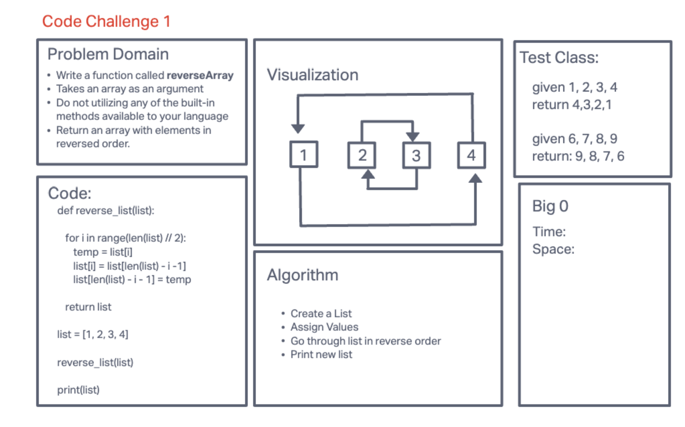

# Challenge-1

Created a function that returns list elements in reverse order

## Whiteboard Process



## Approach & Efficiency

- Created function to take list as input
- Used a for loop to iterate through first half of list.
- i variable taks on values from 0 to half the length of list
- loop temporarily stores the value of the current element at index i to a variable called temp.
- code replaces the value at index i with the value of the element at the corresponding position from the end of the list
- This moves the element from the end of the list to the position previously held by the element at index i.
- Code sets the value at the corresponding position from the end of the list to the value stored in temp.
- This moves the original element from index i to the end of the list.
- Modified list is returned.

## Solution:

``` def reverse_list(list): ```

```for i in range(len(list) // 2):```

```temp = list[i]```

```list[i] = list[len(list) - i -1]```

```list[len(list) - i - 1] = temp```

```return list```

```list = [1, 2, 3, 4]```

```reverse_list(list)```

```print(list)```
